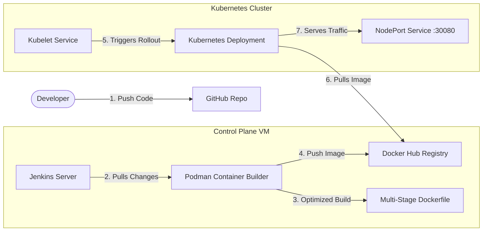

# 🏸 Badminton Rotator App & CI/CD Pipeline

A production-grade, automated CI/CD pipeline deploying **Badminton Rotator Pro**—a premium Next.js court rotation and session queue manager—to a multi-node Kubernetes cluster.

---

## 📱 About the Application

**Badminton Rotator Pro** is a modern Next.js web application designed to manage court schedules, player queues, and game matches for badminton clubs:
*   **Smart Court Rotation**: Automatically balances and schedules balanced, fair matches based on queues.
*   **Queue Management**: Real-time queues tracking waiting times and court status.
*   **Premium Aesthetics**: Sleek, high-performance dark user interface styled with Tailwind CSS, supporting seamless micro-animations.

---

## 🚀 CI/CD Pipeline & Deployment Architecture

The application is deployed automatically through a continuous delivery pipeline powered by Jenkins, Podman, Docker Hub, and Kubernetes:

### 1. Continuous Integration (Jenkins + Podman)
*   **Automated Triggers**: SCM change triggers the Jenkins pipeline automatically on code push.
*   **Multi-Stage Podman Build**: Podman builds the production-ready Next.js image using an optimized multi-stage `Dockerfile`.
*   **Compilation Cache Mounts**: 
    *   `--mount=type=cache,target=/root/.npm` for caching npm dependencies.
    *   `--mount=type=cache,target=/app/.next/cache` for caching Next.js compilation targets.
    *   Uses high-speed regional mirror registries (`registry.npmmirror.com`) to drastically cut down dependency download times.

### 2. Registry Pushing (Docker Hub)
*   **Secure Authentication**: Jenkins logs in using Docker Hub credentials loaded from the secure Jenkins Credential Store.
*   **Image Repository**: Image is tagged and pushed to the public repository `docker.io/venuvgp19/badminton_rotator:latest`.

### 3. Continuous Deployment (Kubernetes Rolling Update)
*   **Rolling Deployments**: The pipeline runs `kubectl apply -f k8s-deployment.yaml` to trigger a rolling update.
*   **Anonymous Image Pull**: Since the repository is public, Kubernetes worker nodes pull the latest image anonymously without needing credentials.
*   **Zero-Downtime Rollout**: Pods transition seamlessly from old replicas to the new container build.

---

## 🌐 How to Access the App

Once deployed, the application is exposed externally via a NodePort Service on port **`30080`**:
*   **Primary Endpoint**: `http://192.168.100.101:30080`
*   **Secondary Endpoint**: `http://192.168.100.102:30080`
