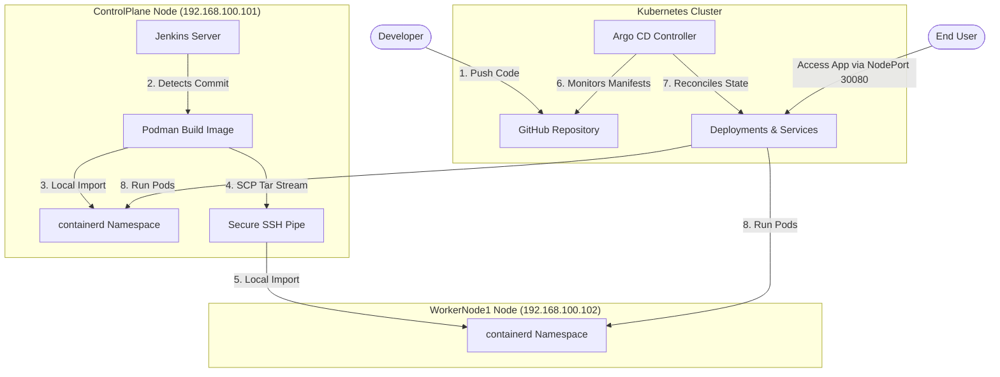

# Badminton Rotator App: Production-Grade Kubernetes & GitOps CI/CD Lab

A fully automated DevOps pipeline deploying a Next.js court rotation app onto a multi-node Kubernetes cluster. This project demonstrates high-availability clustering, automated CI pipelines with Jenkins/Podman, and GitOps CD reconciliation using Argo CD, integrated on a custom virtualized dual-NIC network topology.

---

## 🏗️ Architecture Overview

The infrastructure consists of two CentOS Stream VMs running in Oracle VirtualBox, orchestrating a production-like GitOps delivery loop:



---

## 🌐 1. VM Network Architecture

To simulate a real-world enterprise lab environment, the VMs are configured with a **Dual-NIC network topology**:

*   **Network 1 (Host-Only, `enp0s3`)**: Used for secure node-to-node cluster communication and host-to-VM SSH access.
    *   **ControlPlane IP**: `192.168.100.101`
    *   **WorkerNode1 IP**: `192.168.100.102`
*   **Network 2 (NAT, `enp0s8`)**: Dedicated to outbound internet access.

### Default Gateway Configuration
To ensure DNS resolving and outbound package downloading work while retaining SSH connectivity, the default gateway of the Host-Only network connection was cleared, leaving the NAT interface as the primary default route:
```bash
# Clear default gateway from Host-Only connection
sudo nmcli connection modify enp0s3 ipv4.gateway ''
sudo nmcli device reapply enp0s3
```

---

## ☸️ 2. Kubernetes Cluster Setup & Dual-NIC Fixes

In a multi-NIC environment, the Kubelet registry default behavior binds to the primary routing interface (which is the NAT interface DHCP IP `10.0.3.15` for both nodes), causing IP collisions and cluster routing failures.

### Kubelet Custom IP Configuration
To force the Kubelet service to bind onto the static Host-Only network, the node IP parameters were overridden in `/var/lib/kubelet/kubeadm-flags.env` on both nodes:
*   **ControlPlane**: `--node-ip=192.168.100.101`
*   **WorkerNode1**: `--node-ip=192.168.100.102`

```bash
# Apply and restart kubelet
sudo systemctl daemon-reload && sudo systemctl restart kubelet
```

### Flannel CNI Bindings
The Flannel daemonset CNI configuration was patched to bind exclusively to the Host-Only interface (`enp0s3`), preventing pods from trying to route across the isolated NAT network:
```bash
kubectl patch daemonset kube-flannel-ds -n kube-flannel -p \
  'spec: {template: {spec: {containers: [{name: kube-flannel, args: [--ip-masq, --kube-subnet-mgr, --iface=enp0s3]}]}}}'
```

---

## 🛠️ 3. CI Pipeline (Jenkins + Podman)

The Jenkins CI pipeline runs on the `ControlPlane` node and performs the container build and containerd image injection:

1.  **Checkout**: Pulls code changes from the repository.
2.  **Container Build**: Uses Podman with `--network=host` to build the Next.js application in a lightweight multi-stage Docker environment.
3.  **Local Containerd Import**: Imports the built image into the local Control Plane Kubernetes runtime:
    ```bash
    sudo podman save localhost/badminton-rotator-app:latest | sudo ctr -n=k8s.io images import -
    ```
4.  **Worker Node Containerd Import**: Streams the image directly from the Control Plane to the Worker Node runtime using a secure memory/network pipe:
    ```bash
    sudo podman save localhost/badminton-rotator-app:latest | ssh root@192.168.100.102 "ctr -n=k8s.io images import -"
    ```

---

## 🔁 4. CD Pipeline (Argo CD & GitOps)

Argo CD manages the target state of the cluster by pulling manifests directly from the repository.

### Argo CD Application Definition
The application is defined using Argo CD's custom resource definitions. It utilizes a file inclusion pattern to parse only the Kubernetes deployment file, ignoring the local application source configuration:
```yaml
apiVersion: argoproj.io/v1alpha1
kind: Application
metadata:
  name: badminton-rotator
  namespace: argocd
spec:
  project: default
  source:
    repoURL: 'https://github.com/Venuvgp19/badminton-rotator-app.git'
    targetRevision: HEAD
    path: .
    directory:
      include: 'k8s-deployment.yaml'
  destination:
    server: 'https://kubernetes.default.svc'
    namespace: default
  syncPolicy:
    automated:
      prune: true
      selfHeal: true
```

---

## 🔧 5. Troubleshooting & SRE Case Study

### Case Study: Node DiskPressure & Pod Evictions
During the container compilation phase, high disk space consumption on the Control Plane node triggered Kubelet's `DiskPressure` threshold:

*   **The Issue**: Kubelet initiated an **Image Garbage Collection** sweep, evicting the inactive `badminton-rotator` pods and deleting the local `localhost/badminton-rotator-app:latest` image to free space, causing subsequent pods to enter `ImagePullBackOff`.
*   **The Fix**:
    1.  Executed a Podman system prune to safely clear intermediate layers and free disk space below the threshold:
        ```bash
        sudo podman system prune -a -f
        ```
    2.  Recovered the lost image by streaming it back from `WorkerNode1` via containerd export/import pipelines:
        ```bash
        ssh root@192.168.100.102 "ctr -n=k8s.io images export - localhost/badminton-rotator-app:latest" | sudo ctr -n=k8s.io images import -
        ```
    3.  Cleaned up the evicted pod history to allow the ReplicaSet controller to immediately reschedule and spin up healthy running pods.

---

## 🚀 How to Run the App

Once deployed, the app is exposed via a NodePort Service on port **`30080`**. Access it via:
*   `http://192.168.100.101:30080` (ControlPlane IP)
*   `http://192.168.100.102:30080` (WorkerNode1 IP)
